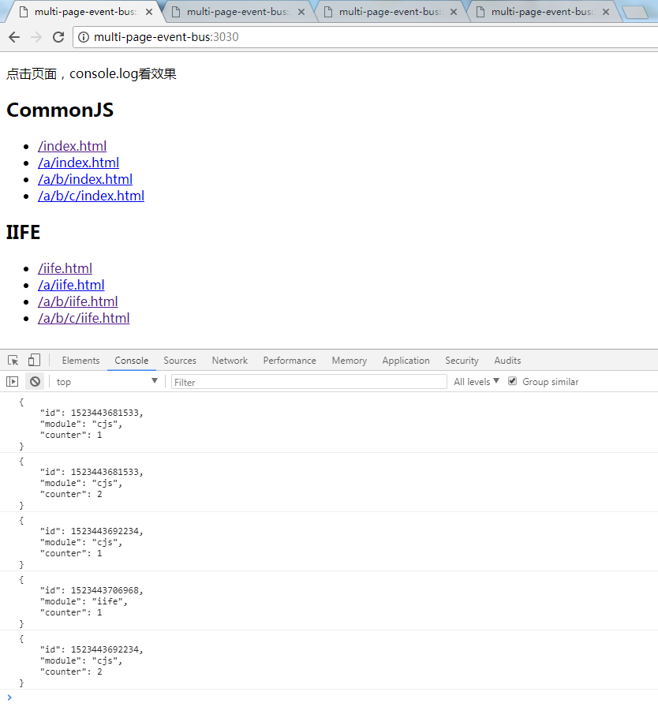

# 多页面事件总线 #

在Node.js的多页面应用中，用于各个页面之间通信的事件总线方案。

## 背景 ##

在模块间业务耦合性不强的应用中，使用多页面架构可以有效的降低应用的复杂度。

但是，有些页面上的逻辑比较复杂，需要切割到多个页面中实现。在多页面架构中，没有前端路由、状态管理等框架的辅助，只能靠刷新页面来获取最新的数据，用户体验不流畅。

基于服务器的事件总线方案，可以在多个页面之间通过监听和分发自定义事件来交换数据，并不需要刷新页面。

## 服务端使用 ##

安装模块：
	
	npm install --save multi-page-event-bus

代码中的引用：

	var bus = require('multi-page-event-bus');
	bus.init(server);

**备注：**

参数`server`是一个`net.Server`实例。`express`实例的`listen`方法、`http.createServer`创建的实例的`listen`方法，都可以返回所需要的`net.Server`参数。

## 客户端使用 ##

事前打包或加载分发目录`dist`下的`socket.io/socket.io.js`。

	var bus = require('multi-page-event-bus');
	bus.on('自定义事件名', function(data){});
	bus.emit('自定义事件名', data);

**备注：**

- 需要构建工具辅助打包，对模块代码进行包装。
- `on`方法接受一个自定义事件名和一个处理事件数据的函数。
- `emit`方法分发一个定义事件和事件数据。
- 使用方需要确保事件名称不重名。

## 构建和演示 ##

可以在本地克隆代码，自行构建项目，演示事件监听、分发的效果。

	# 克隆代码
	git clone https://github.com/peigong/multi-page-event-bus.git
	# 进入项目目录
	cd multi-page-event-bus
	# 安装项目依赖
	npm install
	# 构建项目
	npm run build 
	# 启动演示服务
	npm run start

在浏览器中访问`http://localhost:3030`，打开几个页面中的链接，观察点击页面时，本页面和其他页面监听到的数据。

演示页面是`stub`目录下的`index.html`和`iife.html`页面。
